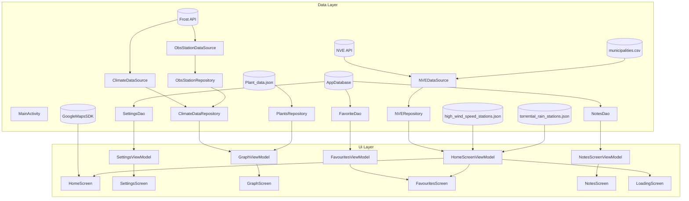
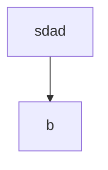

## Arkitekturskisse

```mermaid
graph TD
subgraph Data Layer
main_activity[MainActivity]
fAPI[(Frost API)] --> climate_ds[ClimateDataSource]
fAPI --> os_ds[ObsStationDataSource]
climate_ds-->climate_r[ClimateDataRepository]
mapAPI[(GoogleMapsSDK)]
plants[(Plant_data.json)] --> plants_r[PlantsRepository]
nve[(NVE API)] --> nve_ds[NVEDataSource]
nve_ds --> nve_r[NVERepository]
kommuner[(municipalities.csv)] --> nve_ds
os_ds --> os_r[ObsStationRepository]
os_r --> climate_r
room[(AppDatabase)]
room --> settings_dao[SettingsDao]
room --> favorites_dao[FavoriteDao]
room --> notes_dao[NotesDao]
wind_d[(high_wind_speed_stations.json)]
rain_d[(torrential_rain_stations.json)]
end
subgraph Ui Layer
%%main_activity --> navigator[Navigator]
%%navigator --> home_s
%%navigator --> graph_s
%%navigator --> settings_s
%%navigator --> notes_s
%%navigator --> fav_s
mapAPI --> home_s
home_vm[HomeScreenViewModel] --> home_s[HomeScreen]
%%os_ds --> home_vm
settings_vm[SettingsViewModel] --> settings_s[SettingsScreen]
climate_r --> graph_vm[GraphViewModel]
graph_vm --> graph_s[GraphScreen]
fav_vm[FavouritesViewModel] --> fav_s[FavouritesScreen]
notes_vm[NotesScreenViewModel]-->notes_s[NotesScreen]
home_vm --> LoadingScreen
home_vm --> fav_s
plants_r --> graph_vm
nve_r --> home_vm
settings_dao --> settings_vm
favorites_dao --> fav_vm
notes_dao --> notes_vm
wind_d --> home_vm
rain_d --> home_vm
end
```

```mermaid
flowchart TD
a[sdad] --> b
```
